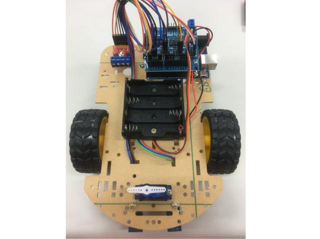

# RobotCar
RobotCar is a Arduino library created for a high school robot group using.

This library includes those following functions:
1.  Left and right Motors controller.
2.  Infrared sensor for line tracing.
3.  Ultrasonic sensor for obstacle detection.

------------
[Heading link](./Installation_guide/guide.md "Installation guide")

